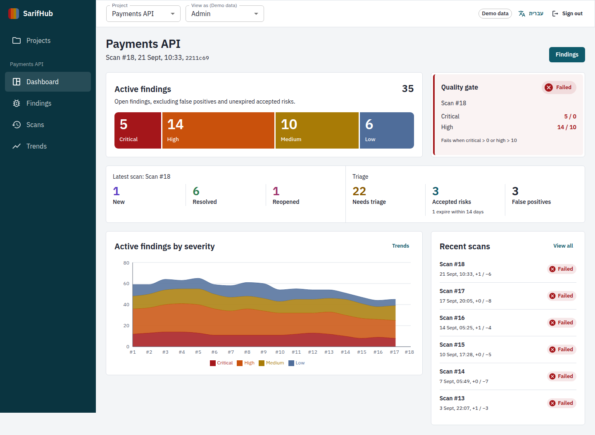
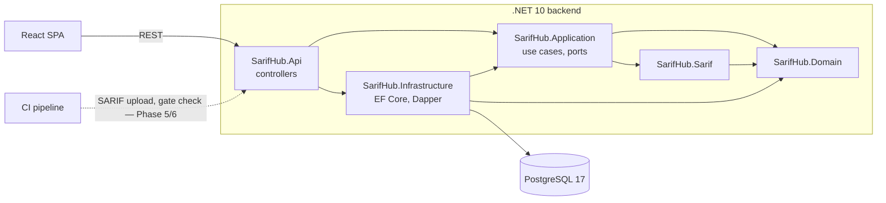

# SarifHub

**Security findings from every scanner, tracked across every scan.**

Static analysis tools (CodeQL, Semgrep and many others) write their results as [SARIF](https://sarifweb.azurewebsites.net/),
a JSON format. Each run is a snapshot: it tells you what the tool found *now*, but not what is new since the last
build, what was fixed, what came back, or which findings a person already reviewed. SarifHub keeps that history.
It tracks each finding across scans with a stable fingerprint, supports triage with an audit trail (confirmed,
false positive, accepted risk until a date), and turns the result into a quality gate a CI pipeline can check.

It is for development teams and security leads who run several scanners and want one place to see which findings
matter, without re-triaging the same results on every build.

This is a portfolio project, built in ten documented phases. It is meant to show how I approach a product end to
end: domain modelling, a layered ASP.NET Core backend, PostgreSQL design measured with real query plans,
a typed React frontend, and security decisions written down as ADRs.


<sub>The dashboard in the React frontend (Phase 1, running on its mock API; it moves to the real API in Phase 7).</sub>

## Status

| Phase | Scope | Status |
|---|---|---|
| 1 | Product and dashboard design, frontend on mock data | Done |
| 2 | Architecture and database design | Done |
| 3 | Backend foundation: ASP.NET Core, PostgreSQL, EF Core, read API | **Done** |
| 4 | SARIF parser and generated test fixtures | Planned |
| 5 | Fingerprinting, scan diff engine, SARIF upload | Planned |
| 6 | Authentication and authorization (JWT, API keys), triage | Planned |
| 7 | Frontend on the real API | Planned |
| 8 | Unit and integration tests | Planned |
| 9 | Docker Compose and GitHub Actions | Planned |
| 10 | Documentation, screenshots, release | Planned |

**What works today**

- **Backend:** a .NET 10 API serving the read endpoints the frontend uses (projects, dashboard, scans, scan details,
  findings with server-side paging, filtering and sorting, finding details, trends, tools) from PostgreSQL 17, with a
  realistic development dataset. OpenAPI document and Scalar API reference.
- **Frontend:** every screen, in English and Hebrew (right-to-left), running on an in-memory mock that implements the
  same API contract.

**Not yet:** uploading SARIF (Phases 4–5), sign-in and permissions (Phase 6; until then the API runs only in the
Development environment and acts as a seeded demo user — see [ADR 0011](docs/phase2/docs/adr/0011-development-caller-until-authentication.md)),
triage from the API (Phase 6), the frontend calling the API (Phase 7), automated tests (Phase 8).

## Architecture



- **Domain** holds the model and its rules: a *finding* outlives scans; each scan records where it was seen
  (*occurrences*) and when it disappeared (*resolutions*); lifecycle (New, Existing, Reopened, Resolved) is derived
  from that history, triage is a separate human decision. No framework dependencies.
- **Application** holds the use cases and the ports (interfaces) they need. It references no EF Core, Dapper or
  ASP.NET Core package.
- **Infrastructure** implements the ports with PostgreSQL. **Api** is the composition root: thin controllers,
  one per API area ([ADR 0010](docs/phase2/docs/adr/0010-controllers.md)).

**Why both EF Core and Dapper** ([ADR 0003](docs/phase2/docs/adr/0003-efcore-writes-dapper-reads.md)).
Writes are aggregate-shaped and need migrations and optimistic concurrency: EF Core owns the schema, all writes and
simple reads by id (finding details, the tool list). Reads for the grid, dashboard, scans and trends are
report-shaped — seven counts in one pass with `FILTER`, a whitelisted dynamic `ORDER BY`, aggregates over scan
snapshots — so they are hand-written SQL run with Dapper over the same connection pool, where the exact SQL is
visible and its query plan was measured ([data model §4](docs/phase2/docs/architecture/data-model.md)).

## Tech stack

| Area | Technology | Used for |
|---|---|---|
| Backend | .NET 10 (LTS), ASP.NET Core controllers | HTTP API, Problem Details (RFC 9457), health check |
| Persistence | PostgreSQL 17, EF Core 10 + Npgsql | Schema, migrations, writes, reads by id |
| Read models | Dapper | Report-shaped SQL (grid, dashboard, trends) |
| API docs | Microsoft.AspNetCore.OpenApi, Scalar | OpenAPI document and interactive reference |
| Frontend | React 19, TypeScript, MUI + MUI X DataGrid, TanStack Query, Recharts | UI, server state, charts |
| Build hygiene | Central package management, lock files, .NET analyzers, warnings as errors | Reproducible, clean builds |

## Running locally

Prerequisites: [.NET SDK 10](https://dotnet.microsoft.com/download) (10.0.100 or later),
[Docker](https://docs.docker.com/get-docker/) for PostgreSQL (or any PostgreSQL 17 you already run),
and Node.js 20.19+ or 22.12+ for the frontend.

Backend commands run from the `backend` folder. Each command is one line and works in bash and PowerShell,
except the password line, which has a PowerShell variant.

**1. Start PostgreSQL 17.** Generate a password for this local database (it never goes into the repository):

```bash
cd backend
DB_PASSWORD=$(openssl rand -hex 16)
# PowerShell: $DB_PASSWORD = [guid]::NewGuid().ToString('N')
docker run --name sarifhub-postgres -d -p 5432:5432 -e POSTGRES_USER=sarifhub -e POSTGRES_PASSWORD=$DB_PASSWORD -e POSTGRES_DB=sarifhub postgres:17
```

**2. Store the connection string** in .NET user secrets (kept in your user profile, outside the repository):

```bash
dotnet user-secrets set "ConnectionStrings:SarifHub" "Host=localhost;Port=5432;Database=sarifhub;Username=sarifhub;Password=$DB_PASSWORD" --project src/SarifHub.Api
```

Alternatively set the environment variable `ConnectionStrings__SarifHub`.

<details>
<summary><b>Without Docker</b> (for example on Windows with the PostgreSQL 17 installer)</summary>

Install PostgreSQL 17 (the EDB installer includes `pg_trgm`), then replace step 1 with the commands below and
continue with step 2 in the same PowerShell window. `psql` asks for the `postgres` password you chose in the installer.
If the installer used another port than 5432, change `Port=` in step 2.

```powershell
cd backend
$DB_PASSWORD = [guid]::NewGuid().ToString('N')
& "C:\Program Files\PostgreSQL\17\bin\psql.exe" -U postgres -h localhost -c "CREATE ROLE sarifhub LOGIN CREATEDB PASSWORD '$DB_PASSWORD';" -c "CREATE DATABASE sarifhub OWNER sarifhub;"
```

</details>

**3. Build, then create the schema** with the EF Core migration (`dotnet-ef` is a local tool pinned in
`.config/dotnet-tools.json`; it needs a restored, built solution):

```bash
dotnet tool restore
dotnet build
dotnet ef database update --project src/SarifHub.Infrastructure --startup-project src/SarifHub.Api
```

On an empty database EF Core first logs a failed `SELECT … FROM "__EFMigrationsHistory"`: that is it checking
whether the history table exists. The command ends with `Done.`

**4. Load the demo data** (four projects, 36 scans, about 140 findings with history and triage decisions):

```bash
dotnet run --project src/SarifHub.Api -- seed
```

The seed only runs on a database without projects. To start over, drop the database with
`dotnet ef database drop --project src/SarifHub.Infrastructure --startup-project src/SarifHub.Api` and repeat steps 3–4.

**5. Start the API:**

```bash
dotnet run --project src/SarifHub.Api
```

**6. Open the API reference** at <http://localhost:5080/scalar> (OpenAPI document: <http://localhost:5080/openapi/v1.json>,
health: <http://localhost:5080/health>).

**7. Frontend** (still on its mock API until Phase 7):

```bash
cd ../frontend
npm install
npm run dev
```

Open <http://localhost:5173> and sign in as `demo@sarifhub.local` with any password (demo build only).
The API already allows this origin through CORS.

## Example requests

Ids and timestamps differ on every machine (the seed dates scans relative to "now"); the counts are the same.

```bash
curl -s http://localhost:5080/api/projects
```

```json
[
  {
    "id": "019f08af-d2ce-7d21-bc76-d63a19b2477e",
    "key": "payments-api",
    "name": "Payments API",
    "repositoryUrl": "https://github.com/example-org/payments-api",
    "defaultBranch": "main",
    "myRole": "Admin",
    "lastScan": {
      "id": "01a0d67e-c8ee-7546-83bb-0ecc235c53e4",
      "number": 18,
      "uploadedAt": "2026-09-25T02:57:08.334899+00:00",
      "gate": {
        "result": "Failed",
        "reasons": ["8 critical findings (max 0)", "15 high findings (max 10)"],
        "evaluatedCounts": { "critical": 8, "high": 15, "medium": 6, "low": 6 }
      }
    },
    "activeBySeverity": { "critical": 8, "high": 15, "medium": 6, "low": 6 }
  },
  …
]
```

Open critical and high findings, most recently seen first, 25 per page:

```bash
curl -s "http://localhost:5080/api/projects/{projectId}/findings?severity=Critical,High&status=New,Existing,Reopened&sort=lastSeenAt&dir=desc&pageSize=25"
```

```json
{
  "items": [
    {
      "id": "019fa3fb-aece-704c-97c7-02080ee3bafb",
      "severity": "High",
      "lifecycle": "Existing",
      "triage": "Confirmed",
      "tool": "CodeQL",
      "ruleId": "cs/path-injection",
      "ruleName": "Uncontrolled data used in path expression",
      "filePath": "src/Payments.Api/Controllers/StatementsController.cs",
      "line": 35,
      "firstSeenAt": "2026-07-27T14:30:08.334899+00:00",
      "lastSeenAt": "2026-09-25T02:57:08.334899+00:00",
      "firstSeenScan": 1,
      "lastSeenScan": 18,
      "acceptedRiskExpiresAt": null
    },
    …
  ],
  "totalCount": 26,
  "page": 0,
  "pageSize": 25
}
```

Invalid input is rejected with Problem Details. Sort fields come from an allow-list and are never put into SQL:

```bash
curl -s "http://localhost:5080/api/projects/{projectId}/findings?sort=password&pageSize=10"
```

```json
{
  "type": "https://tools.ietf.org/html/rfc9110#section-15.5.1",
  "title": "One or more validation errors occurred.",
  "status": 400,
  "errors": {
    "sort": ["Sort must be one of: severity, lifecycle, triage, tool, ruleId, filePath, line, firstSeenAt, lastSeenAt."],
    "pageSize": ["Page size must be one of 25, 50, 100."]
  },
  "traceId": "00-c71aa28fd29e22347e714230bab90ed3-490a8df1be0fef33-00"
}
```

| Endpoint | Returns |
|---|---|
| `GET /api/projects` | The caller's projects with role, latest scan and active findings |
| `GET /api/projects/{projectId}/dashboard` | Everything the dashboard shows, in one response |
| `GET /api/projects/{projectId}/scans` | Scans, newest first |
| `GET /api/projects/{projectId}/scans/{number}` | One scan: diff, severity breakdown, stored gate result |
| `GET /api/projects/{projectId}/findings` | A page of findings: `page`, `pageSize`, `sort`, `dir`, `severity`, `status`, `triage`, `tool`, `q`, `scan` |
| `GET /api/projects/{projectId}/findings/{findingId}` | A finding with occurrences and triage history (`ETag` = row version) |
| `GET /api/projects/{projectId}/trends` | One point per scan |
| `GET /api/projects/{projectId}/tools` | Tool names for the filter |

Response shapes match the frontend contract in [`frontend/src/api/types.ts`](frontend/src/api/types.ts).
A project the caller is not a member of answers `404`, exactly like one that does not exist.

## Repository structure

```
backend/
  SarifHub.slnx
  src/
    SarifHub.Domain/           Entities, value objects, lifecycle and triage rules, quality gate
    SarifHub.Sarif/            SARIF reader (Phase 4; format constants for now)
    SarifHub.Application/      Use cases, read-model ports, response DTOs, query validation
    SarifHub.Infrastructure/   DbContext, entity configurations, migrations, Dapper read models, demo seed
    SarifHub.Api/              Controllers, Problem Details, OpenAPI + Scalar, CORS, health check
frontend/                      React SPA (see frontend/README.md)
docs/
  phase1/                      Product and UI plan, screenshots
  phase2/docs/                 Architecture, data model, API contract, ADRs
  phase3/                      Backend foundation plan and schema comparison
```

## Documentation

- [Product and UI plan](docs/phase2/docs/product/ui-plan.md) — vocabulary, screens, design decisions
- [Architecture overview](docs/phase2/docs/architecture/overview.md) — solution structure, ingestion pipeline, security controls, technology choices
- [Data model](docs/phase2/docs/architecture/data-model.md) — ERD, decisions, constraints, measured query plans ([schema](docs/phase2/docs/architecture/schema.sql))
- [API contract](docs/phase2/docs/architecture/api.md) — endpoints, authorization matrix, CI upload and quality gate
- [Architecture decision records](docs/phase2/docs/adr/README.md)
- Phase 3: [implementation plan](docs/phase3/implementation-plan.md), [migration vs. schema.sql](docs/phase3/schema-comparison.md), [verification record](docs/phase3/verification.md)

## License

[MIT](LICENSE)
