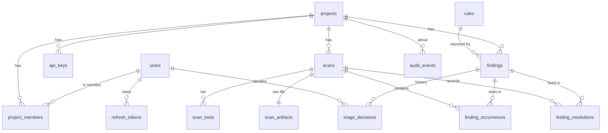

# SarifHub — Data Model (Phase 2)

Reference DDL: [`schema.sql`](schema.sql). Validation scripts: [`validation/`](validation/README.md).
From Phase 3 on, EF Core migrations are the source of truth; `schema.sql` documents the intended result.

## 1. Entity relationships



## 2. The central idea: a finding outlives scans

```
finding 7f3a  (fingerprint v1:9c1e…, cs/sql-injection)
  ├── occurrence  scan 8   New       LedgerRepository.cs:293
  ├── occurrence  scan 9   Existing  LedgerRepository.cs:293
  ├── occurrence  scan 10  Existing  LedgerRepository.cs:291   ← line moved, same finding
  ├── resolution  scan 11                                      ← absent from scan 11
  ├── occurrence  scan 17  Reopened  LedgerRepository.cs:291   ← came back
  └── occurrence  scan 18  Existing  LedgerRepository.cs:291
```

| Table | Grows with | Role |
|---|---|---|
| `findings` | Distinct problems ever seen | Current state, used by every list and count |
| `finding_occurrences` | Findings × scans they appear in | History: first seen, line drift, lifecycle per scan |
| `finding_resolutions` | Disappearances | History of fixes; feeds "Resolved in scan N" |
| `triage_decisions` | Human decisions | Append-only audit of triage |

## 3. Decisions

**3.1 Current state is denormalized onto `findings`.**
`lifecycle`, `triage_status`, `accepted_risk_expires_at`, last location and message live on the finding row.
The history tables are the record; the finding row is the index. Without this, the default grid would need
"latest occurrence per finding" and "latest decision per finding" subqueries on every page.
*Cost:* each write must update both in one transaction. Only two code paths write them (ingestion, triage),
both in Application handlers, both covered by integration tests.

**3.2 Occurrences and resolutions are separate tables.**
An occurrence has a location, a message and a severity; a resolution has none of those. One table with a
`Resolved` value and nullable location columns would make every consumer handle a row that is not an occurrence.

**3.3 Scans are immutable snapshots.**
Diff counts, severity counts and the quality gate result are written once when a scan completes. Trends read
only the `scans` table (one row per point). The gate snapshot records the policy and counts used, so
"why did build 412 pass?" has a stored answer.

**3.4 Enums as `text` + `CHECK`, not PostgreSQL enums.**
Readable in SQL and logs, and adding a value is an ordinary migration (PostgreSQL enums cannot drop values and
need special handling in transactions). EF Core maps them with value converters.

**3.5 `severity_rank` as a stored generated column.**
Text sorts alphabetically (Critical, High, Low, Medium). A generated rank lets the default grid order walk an index
instead of sorting every open finding.

**3.6 UUIDv7 keys generated in .NET (`Guid.CreateVersion7()`).**
Time-ordered, so inserts append to the B-tree instead of scattering. Generated in the application, so the IDs exist
before the database round trip (useful when building a whole scan graph in memory) and no PostgreSQL 18 feature is required.

**3.7 The fingerprint carries its version** (`v1:<sha256>`).
When the algorithm changes, old and new values cannot collide, and a migration job can recompute from the
stored raw SARIF (`scan_artifacts`).

**3.8 Raw SARIF is kept, compressed, in PostgreSQL.**
It makes fingerprint upgrades and parser fixes replayable. One storage system keeps local setup to `docker compose up`.
*Cost:* database size grows with uploads. The 50 MB limit bounds each file; moving artifacts to object storage is a v2 item.

**3.9 The database enforces what must never be wrong**, independent of application bugs:

| Rule | Constraint |
|---|---|
| Project key is URL-safe | `CHECK (key ~ '^[a-z0-9][a-z0-9-]{1,62}$')` |
| API key hash is exactly a SHA-256 | `CHECK (octet_length(key_hash) = 32)` |
| API key scopes are from a known set | `CHECK (scopes <@ ARRAY[...])` |
| A scan has exactly one uploader (user or key) | `CHECK (num_nonnulls(...) = 1)` |
| Scan numbers are unique per project | `UNIQUE (project_id, number)` |
| One finding per fingerprint per project | `UNIQUE (project_id, fingerprint)` |
| Accepted risk ⇔ expiry date | `CHECK ((status = 'AcceptedRisk') = (expires_at IS NOT NULL))` on findings and decisions |
| Human decisions other than Confirmed carry a reason ≥ 10 chars | `CHECK` on `triage_decisions` |

`validation/01-constraints.sql` inserts a violating row for each rule; all were rejected on PostgreSQL 16.

## 4. Query plans at volume

Measured on PostgreSQL 16 with 59,000 findings across 40 projects and 457,000 occurrences for the large
project (20,000 findings, 60 scans). Laptop-class container, warm cache.

| Query | Plan | Time |
|---|---|---|
| Grid, default view, page 1 | Index scan on `ix_findings_open_severity`, stops after 25 rows | 0.2 ms |
| Grid, page 200 (offset 5,000) | Bitmap scan + in-memory sort of 9,054 open rows | 7.4 ms |
| Pager total (open + untriaged) | Bitmap scan on the partial index | 2.9 ms |
| Dashboard counts (7 numbers, one pass with `FILTER`) | Bitmap scan on the partial index | 3.5 ms |
| Search: path contains `module17/sub3` | Trigram GIN index | 7.3 ms |
| Scan view: findings in scan 40 (10,230 rows), first page | Occurrence PK + hash join | 22 ms |
| Diff engine input: all findings of the project | Index on `project_id` | 5.3 ms |
| Finding details: occurrence history | `ix_occurrences_finding` | 0.4 ms |

Conclusions that shaped the design:

- **Offset paging is kept.** Deep pages stay under 10 ms at this size, and the UI needs page numbers and a total.
  Keyset pagination would be the next step above ~100,000 open findings per project.
- **No cache layer.** The dashboard is one indexed query of a few milliseconds; a cache would add invalidation
  bugs (triage changes counts) for no measurable gain.
- **The scan view is the slowest query** (22 ms): it joins every finding present in the scan. Acceptable for v1;
  if needed, a scan-scoped index on `(scan_id, severity)` in `finding_occurrences` lets it stop after one page.

## 5. Growth and known trade-offs

- `finding_occurrences` is the largest table: 126 MB for 457,000 rows, because each row keeps the message and path
  as they were in that scan. Options when it matters: store only fields that changed since the previous occurrence,
  or partition by `scan_id` range. Not needed for v1.
- Rule descriptions are global per `(tool_name, rule_id)` and the last upload wins. Different tool versions
  describing the same rule differently is a cosmetic issue, not a correctness one.
- Deleting a project cascades to everything except `audit_events`, which keeps rows with `project_id` set to NULL:
  the audit trail must survive the thing it audits.
