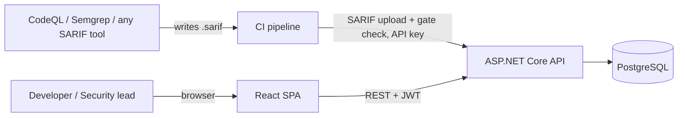
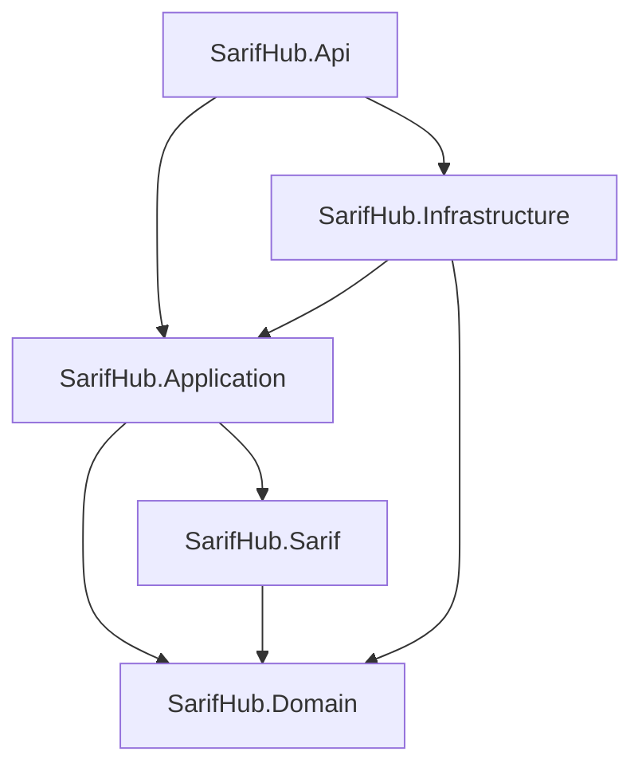
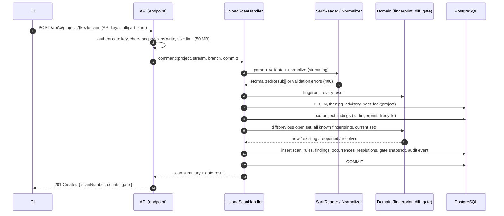

# SarifHub — Architecture (Phase 2)

## 1. Context



SarifHub has two kinds of clients with different trust models:

| Client | Authenticates with | Can do |
|---|---|---|
| People (browser) | Email + password → JWT access token + refresh token | Everything their project role allows |
| CI (machine) | Project-scoped API key with explicit scopes | Upload scans (`scans:write`), read gate result (`gate:read`). Nothing else. |

## 2. Solution structure

```
backend/
  src/
    SarifHub.Domain          Entities, value objects, domain services. No dependencies.
    SarifHub.Sarif           SARIF 2.1.0 reading and normalization. Depends only on Domain and System.Text.Json.
    SarifHub.Application     Use cases, authorization checks, ports (interfaces), DTOs.
    SarifHub.Infrastructure  EF Core DbContext + migrations, Dapper read queries, Identity, JWT, API key hashing.
    SarifHub.Api             HTTP: controllers (one per API area), auth setup, Problem Details, OpenAPI, rate limiting.
  tools/
    SarifHub.TestDataGenerator   Writes schema-valid SARIF fixtures (Phase 4)
  tests/
    SarifHub.UnitTests           Domain + Sarif + Application (no database)
    SarifHub.IntegrationTests    API → PostgreSQL through Testcontainers
    TestData/Sarif/              Generated fixtures
frontend/                        React SPA (Phase 1)
```

Phase 3 created `backend/src` (all five projects); `tools/` and `tests/` arrive in Phases 4 and 8.



**Dependency rule:** arrows point inward. Domain and Sarif know nothing about HTTP or the database, which is what
lets the parser, the fingerprint calculator, the diff engine, the gate evaluator and the triage rules be unit tested
with plain inputs and outputs. Infrastructure implements interfaces declared in Application (read models,
`ICurrentUser`, `IApiKeyHasher`, `ITokenService`); time comes from .NET's built-in `TimeProvider`, so no custom
clock interface is needed. Api is the only project that knows about all of them (composition root).

Why five projects and not one: the separation pays for itself in exactly one place — the ingestion pipeline is
pure logic that must be tested hard. `SarifHub.Sarif` is separate from Domain because SARIF is an external format:
its shapes should not leak into SarifHub's own model.

## 3. Where the logic lives

| Concern | Project | Type |
|---|---|---|
| Read SARIF, validate structure, map to `NormalizedResult` | Sarif | `SarifReader`, `SarifNormalizer` |
| Severity mapping (security-severity → level fallback) | Sarif | `SeverityMapper` |
| Fingerprint | Domain | `FingerprintCalculator` (versioned, Phase 5) |
| New / Existing / Reopened / Resolved | Domain | `ScanDiffEngine` — pure function over two sets |
| Quality gate | Domain | `QualityGateEvaluator` |
| Who may make which triage decision | Domain | `TriagePolicy` (same matrix as `frontend/src/domain/permissions.ts`) |
| Transaction, locking, persistence order | Application + Infrastructure | `UploadScanHandler` |
| Grid, dashboard, trends queries | Infrastructure | Dapper query classes behind Application interfaces |

## 4. Scan ingestion



Key properties:

- **The diff engine needs no history query.** `findings.lifecycle` always reflects the latest scan, so
  "present in the previous scan" is `lifecycle <> 'Resolved'` and "ever seen" is "exists for this project".
  One indexed query (~5 ms for 20,000 findings, see data-model.md) gives the engine both sets.
- **Uploads for the same project are serialized** with a transaction-scoped advisory lock. Two concurrent uploads
  would otherwise diff against the same previous state and both claim scan number N+1. Different projects still
  ingest in parallel.
- **All-or-nothing.** Parsing and fingerprinting happen before the transaction; the transaction only writes.
  A malformed file never creates a half-scan.
- **Idempotent re-upload.** If the same file (same SHA-256) was already ingested for this project on the same commit,
  the API returns the existing scan (200) instead of creating a duplicate — CI retries are common.
- **Synchronous by design (v1).** CI wants the gate answer in the same call. Limits (50 MB, 25,000 results per file)
  keep the request bounded. The handler is a plain application service, so moving it behind a queue later
  changes the endpoint, not the logic. See ADR 0006.

## 5. Quality gate

- Evaluated once, when the scan completes, against the project policy in force at that moment.
- Stored on the scan with the policy and counts used (`gate_evaluation` JSON). This is what CI was told, and it
  stays true even if someone later triages findings or changes thresholds — an audit requirement.
- The dashboard's *current* active counts are computed live; the *scan's* gate result is historical.
  The Phase 1 mock computes gate results live; Phase 7 switches the UI to the stored snapshot.

## 6. Security architecture (detail in `docs/security.md`, Phase 10)

| Threat | Control |
|---|---|
| Stolen database dump reveals API keys | Only SHA-256 of 256-bit random keys is stored; the key is shown once |
| Password theft | ASP.NET Core Identity hashing (PBKDF2), lockout after failed attempts, login rate limiting |
| Token theft | 15-minute access token in memory; refresh token in an `HttpOnly; Secure; SameSite=Strict` cookie, rotated on use, reuse detection revokes the chain |
| Cross-project access (IDOR) | Every project-scoped query filters by project id **and** checks membership in the handler |
| Oversized / hostile uploads | Kestrel body limit, streaming JSON reader with max depth, result count limit, no file paths from SARIF ever touch the file system |
| Silent suppression of findings | False positive and accepted risk need SecurityLead; every decision is append-only and audited |
| Information leakage in errors | RFC 9457 Problem Details with generic messages; details only in server logs with a correlation id |

## 7. Technology choices

| Choice | Why | Rejected alternative |
|---|---|---|
| .NET 10 (LTS) | .NET 8 and 9 reach end of support on 10 Nov 2026; .NET 10 is supported to Nov 2028 | .NET 8: would be out of support weeks after the project is published |
| Controllers, one per API area ([ADR 0010](../adr/0010-controllers.md)) | Familiar to the maintainer; routes, response types and OpenAPI metadata of an area stay together; `[ApiController]` validation Problem Details | Minimal APIs: equally capable, planned in Phase 2, replaced in Phase 3 |
| EF Core 10 + Npgsql | Migrations, change tracking, optimistic concurrency for writes | Dapper-only: hand-written migrations and change tracking |
| Dapper for read models | Dashboard (one pass with `FILTER`), trends, grid with whitelisted dynamic sort: explicit SQL is clearer and measurable | EF Core LINQ for everything: harder to control the exact SQL for aggregates |
| ASP.NET Core Identity (core only) + own JWT issuing | Proven password hashing and lockout; no UI scaffolding | Custom password code; external IdP (adds a service to run locally) |
| PostgreSQL 17 | `jsonb`, `pg_trgm`, partial indexes, advisory locks — all used on purpose | SQL Server: works, heavier local setup |
| Testcontainers | Integration tests need real PostgreSQL behavior (advisory locks, trigram search, check constraints) | EF InMemory / SQLite: would test a different database |
| Built-in OpenAPI + Scalar UI | Swashbuckle is no longer in the default template; Scalar is MIT and reads the built-in document | — |

**Deliberately not used:** MediatR and AutoMapper (both moved to commercial licensing in 2025; plain handlers and
explicit mapping are enough here), a message queue (no asynchronous workload in v1), Redis (no cache is needed at
this scale — measured, not assumed), microservices (one deployable is the honest size of this product).
