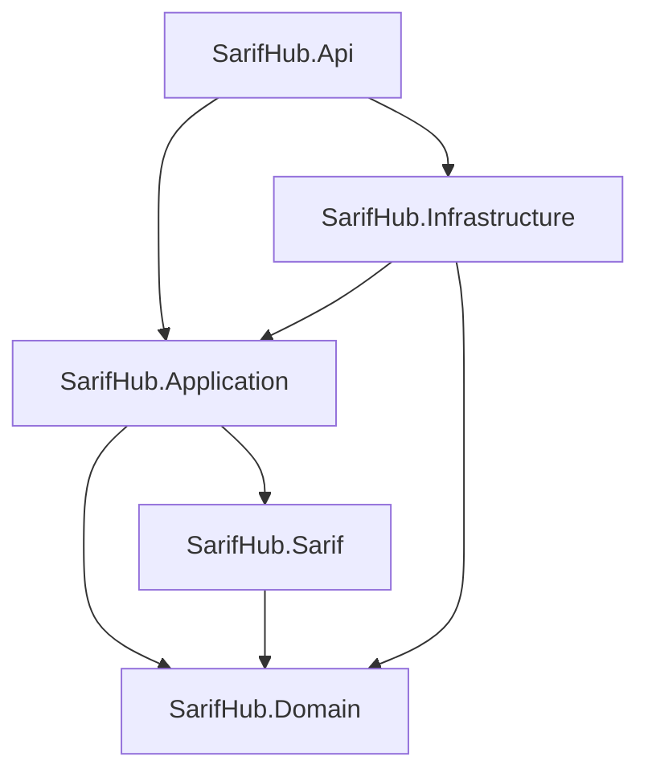

# Phase 3 — Backend foundation: implementation plan

**Goal.** Create the ASP.NET Core backend that later phases build on: the solution structure, the domain model,
the PostgreSQL schema as an EF Core migration, a realistic development seed, and the read-only API the frontend
already uses (contract: [`frontend/src/api/types.ts`](../../frontend/src/api/types.ts)).

**Out of scope** (and deliberately not stubbed): SARIF parsing (Phase 4), fingerprinting and the scan diff engine
(Phase 5), authentication and authorization (Phase 6), connecting the frontend (Phase 7), the automated test suite
(Phase 8), Docker Compose and CI (Phase 9).

Decisions made while planning: [ADR 0010 — Controllers](../phase2/docs/adr/0010-controllers.md) and
[ADR 0011 — Development-only caller until Phase 6](../phase2/docs/adr/0011-development-caller-until-authentication.md).

## 1. Solution structure

```
frontend/                       React SPA (Phase 1), unchanged in this phase
backend/
  SarifHub.slnx
  global.json                   SDK 10.0.1xx, roll forward to later feature bands
  Directory.Build.props         net10.0, nullable, warnings as errors, .NET analyzers (Recommended), lock files
  Directory.Packages.props      central package versions
  nuget.config                  nuget.org only, with package source mapping
  .config/dotnet-tools.json     dotnet-ef as a local tool (same version for everyone)
  src/
    SarifHub.Domain             Entities, value objects, TriagePolicy, QualityGateEvaluator
    SarifHub.Sarif              Placeholder for the Phase 4 parser (format constants only)
    SarifHub.Application        Read use cases, read-model ports, DTOs matching types.ts, query validation
    SarifHub.Infrastructure     DbContext, entity configurations, migrations, Dapper read models, seed
    SarifHub.Api                Controllers, Problem Details, OpenAPI + Scalar, CORS, health check
docs/                           Product, architecture, ADRs, phase notes
```

The backend and the frontend are siblings: each has its own toolchain and can be built on its own.

## 2. Packages

| Package | Project | Purpose |
|---|---|---|
| `Npgsql.EntityFrameworkCore.PostgreSQL` | Infrastructure | EF Core provider; brings EF Core 10 and Npgsql |
| `EFCore.NamingConventions` | Infrastructure | `snake_case` table and column names, as in `schema.sql` |
| `Dapper` | Infrastructure | Hand-written SQL for report-shaped reads (ADR 0003) |
| `Microsoft.Extensions.Diagnostics.HealthChecks.EntityFrameworkCore` | Infrastructure | `/health` checks the database connection |
| `Microsoft.AspNetCore.OpenApi` | Api | Built-in OpenAPI document generation |
| `Scalar.AspNetCore` | Api | Interactive API reference over the OpenAPI document (Development only) |
| `Microsoft.EntityFrameworkCore.Design` | Api (design time, not shipped) | Lets `dotnet ef` use the Api as startup project |
| `dotnet-ef` (local tool) | — | Create and apply migrations |

Deliberately not used: MediatR, AutoMapper (see architecture overview §7), FluentValidation (query validation
is a few explicit rules), a repository-per-entity layer (EF Core's `DbContext` already is one).

## 3. Dependency graph



Domain references nothing. Application references no EF Core, Dapper, Npgsql or ASP.NET Core package: it declares
the ports (`IDashboardQuery`, `IFindingGridQuery`, …) and Infrastructure implements them. Api is the composition root.

## 4. Endpoints → use case → query

All routes are under `/api`, read-only, and scoped to projects the caller is a member of. A project the caller cannot
see answers `404`, exactly like one that does not exist (no information leak about other projects).

| Endpoint | Controller | Use case (Application) | Read model (Infrastructure) | Data access |
|---|---|---|---|---|
| `GET /projects` | `ProjectsController` | `ListProjects` | `ProjectQueries` | Dapper |
| `GET /projects/{projectId}/dashboard` | `DashboardController` | `GetDashboard` | `DashboardQuery` | Dapper |
| `GET /projects/{projectId}/scans` | `ScansController` | `ListScans` | `ScanQueries` | Dapper |
| `GET /projects/{projectId}/scans/{number}` | `ScansController` | `GetScan` | `ScanQueries` | Dapper |
| `GET /projects/{projectId}/findings` | `FindingsController` | `SearchFindings` | `FindingGridQuery` | Dapper |
| `GET /projects/{projectId}/findings/{findingId}` | `FindingsController` | `GetFinding` | `FindingDetailQuery` | EF Core (no tracking) |
| `GET /projects/{projectId}/trends` | `TrendsController` | `GetTrends` | `TrendQuery` | Dapper |
| `GET /projects/{projectId}/tools` | `ToolsController` | `ListTools` | `ToolQuery` | EF Core (no tracking) |
| `GET /health` | — (health check middleware) | — | EF Core `CanConnect` | — |

**Findings query parameters** (names from the API contract): `page` (0-based), `pageSize` (25, 50, 100),
`sort` (allow-list: `severity, lifecycle, triage, tool, ruleId, filePath, line, firstSeenAt, lastSeenAt`),
`dir` (`asc`, `desc`), `severity`, `status`, `triage`, `tool` (comma-separated lists), `q` (contains search),
`scan` (scan number). Values are parsed into typed values in Application; the SQL `ORDER BY` is chosen by a
`switch` over an enum, so no request text ever reaches SQL except as a bound parameter.

## 5. Database responsibilities

| Concern | Owner |
|---|---|
| Schema, constraints, indexes | EF Core model + migrations (source of truth from this phase on) |
| Writes (seed now; ingestion and triage later) | EF Core, through the domain entities |
| Reads by id (finding detail, tool list) | EF Core, `AsNoTracking`, projected to DTOs |
| Report reads (grid, dashboard, scans, trends, projects) | Dapper with SQL in one place per read model |
| Optimistic concurrency | PostgreSQL `xmin` system column mapped as the row version on `projects` and `findings` |
| Invariants that must never be wrong | `CHECK` / `UNIQUE` constraints, mirrored by domain guards |

The migration is compared with `docs/phase2/docs/architecture/schema.sql` by applying both to empty databases
and diffing a structural listing of each ([`schema-compare.sql`](schema-compare.sql)). The result and the planned
differences are in [schema-comparison.md](schema-comparison.md).

## 6. Implementation order

1. ADRs 0010 and 0011; remove the Minimal API wording from the architecture documents.
2. Solution skeleton, shared build settings, central package versions, local `dotnet-ef` tool.
3. Domain: enums, value objects (`GatePolicy`, `SeverityCounts`, `ScanCounts`, `GateEvaluation`), entities,
   `TriagePolicy`, `QualityGateEvaluator`.
4. Infrastructure: `SarifHubDbContext`, one `IEntityTypeConfiguration` per table, initial migration.
5. Schema comparison against `schema.sql`; fix differences or document why they are planned.
6. Development seed: four projects with scan history built through the domain methods, so every
   denormalized count is consistent with the history tables.
7. Application use cases and ports; Infrastructure read models (Dapper SQL and EF projections).
8. Api: controllers, query validation, Problem Details, OpenAPI + Scalar, CORS for `http://localhost:5173`, `/health`.
9. README, `.gitignore`, secret scan.
10. Verification from a clean clone (below).

## 7. Verification

- `dotnet build SarifHub.slnx -c Release` from a clean tree: 0 warnings, 0 errors. `dotnet format --verify-no-changes`.
- Empty PostgreSQL 17 database → `dotnet ef database update` → schema diff against `schema.sql` → seed → row counts
  and consistency checks (scan counts equal history rows, current lifecycle equals the latest scan).
- Every endpoint: status code, response shape against `types.ts`, representative values, invalid input
  (unknown project, bad GUID, bad sort field, page size out of range, unknown enum value), paging, filtering, sorting.
- Follow the README from a fresh clone, command by command.
- Review the final diff for secrets, generated files and contradictory documentation.
